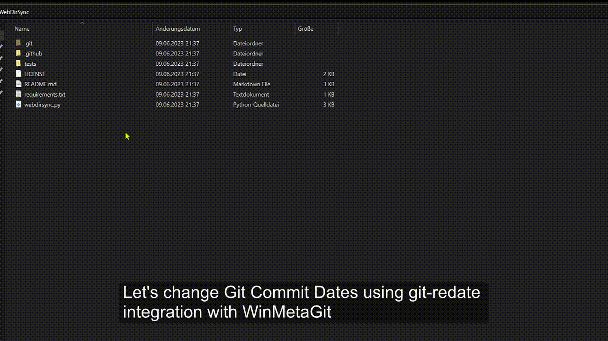

# WinMetaCraft for Windows: Turbocharge Your File Management Experience

## Introducing WinMetaCraft: Streamlined File Management for Power Users

Welcome to a new era of file management with WinMetaCraft, a robust suite of tools designed specifically for Windows users. Overcome complexity, enhance workflows, unlock new possibilities with files, and amplify productivity.

## Utilize the Power of WinMetaCraft: Meta Data Reader, Meta Data Deleter, File Date Updater, Git Redate

WinMetaCraft provides four transformative functionalities:

### Read Meta File: Discover the Hidden Universe in Your Files

Access extensive metadata information concealed within files in just a few clicks. Unearth everything from properties to camera specifications, geolocation data, and more.

### Delete Meta File: Safeguard Your Privacy, Share with Confidence

Delete sensitive metadata from files with a single click. Ensure privacy by eliminating personal information, location details, and other embedded data. Share files confidently, knowing private data stays private.

### Update File Dates: Gain Total Control Over Your File Organization

Manipulate the 'Created' and 'Modified' dates of files precisely. Maintain chronological order, restore original dates, or customize as required. Command total control over file management with accurate timestamps.

## Usage (Read / Delete Meta and File Date Updater)

------

### Git Redate: Transform Your Git Commits Like Never Before

Explore the power of [Git Redate](https://github.com/PotatoLabs/git-redate) directly from the Windows context menu. Modify dates and authors of past Git commits with ease.

Git Redate Integration Usage from Windows Context Menu:

## Quick Access to WinMetaCraft: User-friendly Guide for Windows 11 Users

Activate WinMetaCraft in a few easy steps:

1. Hold down the **Shift** key on the keyboard.
2. Right-click on a file to reveal the context menu.
3. Navigate to the "WinMetaCraft" section in the context menu to access the powerful tools.

## Get Started with WinMetaCraft: Installation and Setup

To simplify the implementation process, an `install.bat` script is provided. Follow these steps to install WinMetaCraft on a Windows machine:

1. Clone or download the WinMetaCraft repository to the local system.
2. Navigate to the WinMetaCraft folder.
3. Right-click on the `install.bat` file.
4. Select **"Run as Administrator"** to initiate the installation process.
5. The process creates a `WinMetaCraft` folder in the **C** drive (`C:\WinMetaCraft`).
6. After the installation, WinMetaCraft is ready for use.

Note: To utilize Git Redate, ensure that Git for Windows is installed on the system. If not installed, it can be downloaded from [here](https://gitforwindows.org/).

## Uninstallation

If WinMetaCraft needs to be removed from the system, the uninstallation is straightforward. Simply run the `uninstall.bat` script:

1. Navigate to the `WinMetaCraft` folder in the **C** drive.
2. Select `uninstall.bat` and **"Run as Administrator"**. This action starts the uninstallation process, removing all registry entries related to WinMetaCraft and deletes the `WinMetaCraft` folder.
3. Once the uninstallation process completes, WinMetaCraft will be removed from the system.

WinMetaCraft integrates a range of advanced tools into one seamless and user-friendly command line interface. It simplifies file management, boosts productivity, and offers an efficient method for handling files on Windows systems.

## Powered by ExifTool and Git Redate

WinMetaCraft leverages the superior capabilities of ExifTool and Git Redate to deliver a seamless user experience for advanced file management.

ExifTool, a powerful command-line application developed by Phil Harvey, is specialized in reading, writing and editing metadata for a wide range of files. These capabilities are utilized in the 'Read Meta File' and 'Delete Meta File' features. Learn more about this remarkable tool [here](https://exiftool.org/).

Git Redate, a smart tool created by Potato Labs, provides a unique functionality that enables users to alter dates and authors of past Git commits easily. Integrated into WinMetaCraft, it's a significant asset for Git users, offering a smooth and integrated user experience on Windows. Discover more about Git Redate [here](https://github.com/PotatoLabs/git-redate).

The combination of these tools in WinMetaCraft provides a comprehensive solution for metadata and Git commit management.

Experience elevated convenience and efficiency with WinMetaCraft for Windows. Streamline file management, augment productivity, and unlock the immense potential of files. With WinMetaCraft, a new era of superior file management begins.

## Join the WinMetaCraft Journey

Contributions to the WinMetaCraft project are warmly welcomed. Suggestions, feature requests, or code improvements are not only appreciated, they're eagerly anticipated. Let's shape the future of file management, together. ✨

Brought to you by power users for the Windows community ❤️
